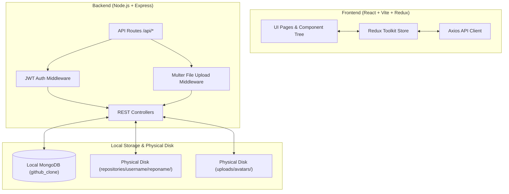

# Implementation Plan: Full-Stack Local-First GitHub Clone

Transform the project into a local-first, full-stack GitHub Clone with local MongoDB persistence, physical disk repository folder management, avatar uploads, and Express REST APIs.

## 🎯 Architecture Overview

---

## 🛠️ Proposed Changes

### Database Schemas & Storage Directories (`backend/`)

#### [MODIFY] [db.js](file:///C:/Users/ravil/.gemini/antigravity-ide/scratch/backend/config/db.js)
- Configure connection to local MongoDB database `mongodb://127.0.0.1:27017/github_clone` with auto-reconnect logic and fail-safe local fallback.

#### [NEW] [User.js](file:///C:/Users/ravil/.gemini/antigravity-ide/scratch/backend/models/User.js)
- Enhance User schema to support `appearance` (light, dark, system), `settings`, `avatar` file path, `bio`, `company`, `location`, `website`, `followersCount`, and `followingCount`.

#### [MODIFY] [Repository.js](file:///C:/Users/ravil/.gemini/antigravity-ide/scratch/backend/models/Repository.js)
- Enhance Repository schema to include `folderPath`, `readmeContent`, `defaultBranch`, `commitsCount`, `openIssuesCount`, `starsCount`, `forksCount`.

#### [NEW] [Issue.js](file:///C:/Users/ravil/.gemini/antigravity-ide/scratch/backend/models/Issue.js)
- Schema for repo issues (`title`, `description`, `status`, `authorId`, `repoId`).

#### [NEW] [PullRequest.js](file:///C:/Users/ravil/.gemini/antigravity-ide/scratch/backend/models/PullRequest.js)
- Schema for pull requests (`title`, `description`, `sourceBranch`, `targetBranch`, `status`, `authorId`, `repoId`).

---

### File System & Controller Logic (`backend/controllers/` & `backend/routes/`)

#### [MODIFY] [profileRoutes.js](file:///C:/Users/ravil/.gemini/antigravity-ide/scratch/backend/routes/profileRoutes.js)
- Implement physical folder creation on disk:
  - When POST `/api/profile/repos/create` is invoked:
    1. Save repository document in MongoDB `repositories` collection.
    2. Create physical directory `repositories/<username>/<repoName>/` on disk.
    3. Generate `README.md` file inside `repositories/<username>/<repoName>/` with template content.
  - When DELETE `/api/profile/repos/:repoId` is invoked:
    1. Remove document from MongoDB.
    2. Remove physical directory `repositories/<username>/<repoName>/` from disk.

#### [NEW] [uploadRoutes.js](file:///C:/Users/ravil/.gemini/antigravity-ide/scratch/backend/routes/uploadRoutes.js)
- Multer file upload handler saving profile pictures to `uploads/avatars/` and serving static files via Express.

#### [NEW] [issueRoutes.js](file:///C:/Users/ravil/.gemini/antigravity-ide/scratch/backend/routes/issueRoutes.js)
- Issue management CRUD APIs.

#### [NEW] [pullRequestRoutes.js](file:///C:/Users/ravil/.gemini/antigravity-ide/scratch/backend/routes/pullRequestRoutes.js)
- Pull request management CRUD APIs.

#### [MODIFY] [server.js](file:///C:/Users/ravil/.gemini/antigravity-ide/scratch/backend/server.js)
- Mount static file middleware for `/uploads` and `/repositories`.
- Mount issue, pull request, and upload routes.
- Add Security Headers (Helmet), CORS with credentials, and Error Logging Middleware.

---

### Frontend Integration (`src/`)

#### [MODIFY] [ProfileSidebar.jsx](file:///C:/Users/ravil/.gemini/antigravity-ide/scratch/src/pages/Profile/ProfileSidebar.jsx)
- Add avatar upload button allowing users to pick an image file and upload it to `/api/profile/avatar`.

#### [MODIFY] [RepoDetails.jsx](file:///C:/Users/ravil/.gemini/antigravity-ide/scratch/src/pages/RepoDetails.jsx)
- Fetch and display the physical `README.md` file content, issues count, and pull requests count from MongoDB.

---

## 🧪 Verification Plan

### Automated Verification
- Run `npm run build` to verify clean client compilation.
- Execute server startup verification to confirm local folder creation (`repositories/`, `uploads/avatars/`) and Express REST API endpoints.

### Manual Verification
- Login / Register and upload a profile photo avatar; confirm it is saved to `uploads/avatars/` on disk and displayed across top navbar and profile sidebar.
- Create a new repository; confirm physical folder `repositories/<username>/<repoName>/README.md` is created on disk.
- Verify repository appears immediately across Dashboard, Sidebar, Profile, and Repositories page without a refresh.
